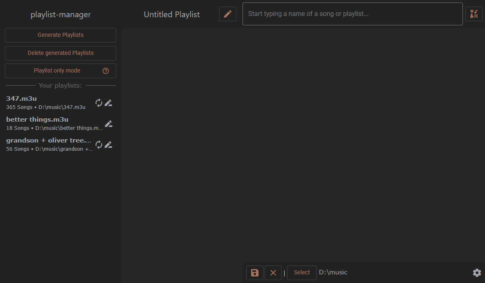
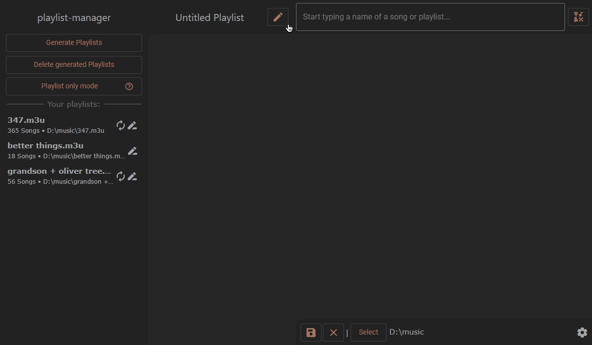
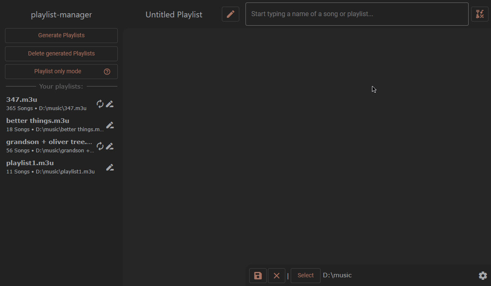
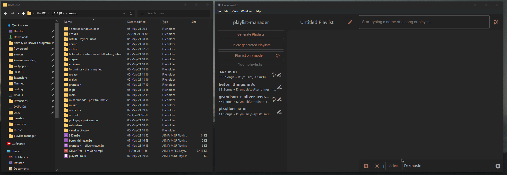
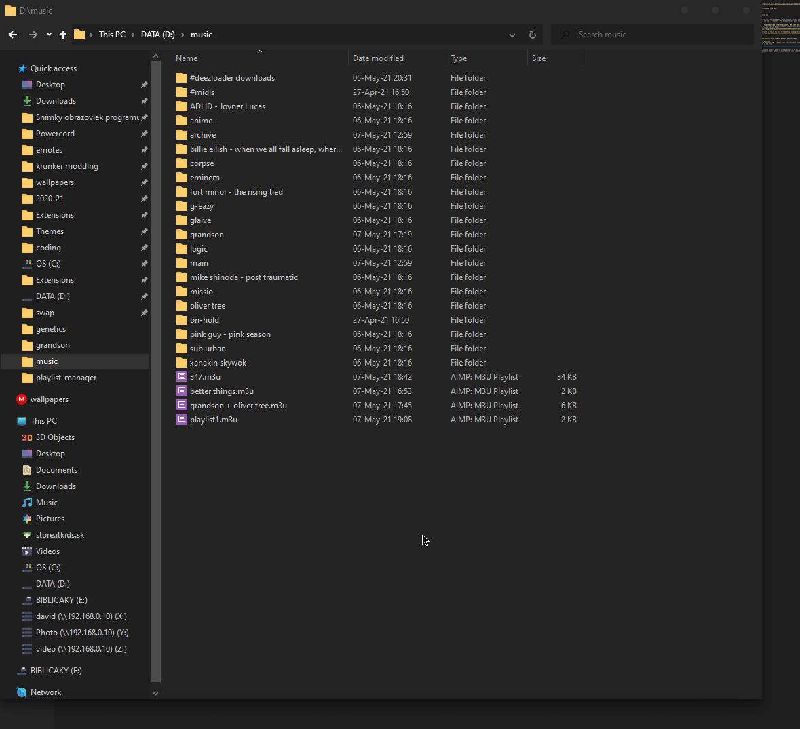

# playlist-manager
easy to use tool to manage offline music playlists cross-device.


## Installing

**download a release**  
Go to the [releases page](https://github.com/KraXen72/playlist-manager/releases) and grab the latest stable release, or use the [nightly release](https://github.com/KraXen72/playlist-manager/releases/tag/nightly) for the latest build from `master`.

| Platform | File |
|---|---|
| Linux (x64) | raw binary |
| Linux (arm64) | raw binary |
| Windows | `.exe` (NSIS installer) |
| macOS | `.dmg` |

> **Note:**  
> `.rpm` and `.deb` packages are not published to releases due to issues with mise (picking the wrong package for the current distro).  
> If you need system-level integration (desktop entry, app icon), build the RPM locally with `pnpm run dist:rpm` and install it with `sudo dnf install dist/playlist-manager-*.rpm`.  

**installing with [mise](https://mise.jdx.dev/) (via github backend)**  
> **Note:**
> There are currently some issues with this installation method. Please use a Release or if that doesen't work, build from source.

required: `mise`
```bash
mise use -g "github:KraXen72/playlist-manager"
```
To pin a specific version:
```bash
mise use -g "github:KraXen72/playlist-manager@2.2.0"
```

**running from source**  
required: `nodejs`, `git`, `pnpm`
```bash
git clone https://github.com/KraXen72/playlist-manager
cd playlist-manager
pnpm i
pnpm run start
```

## Use cases:
### 1. you have your music sorted like this:
```
artist  - single.mp3
        - single2.mp3
        - album1    - song1.mp3
                    - song2.mp3
artist2 - ...
```
This app will make ``artist.m3u`` for each folder, which contains ``single.mp3``, ``single2.mp3``, ``album1/song1.mp3`` and ``album1/song.mp3``, and then ``album1.m3u`` for each subfolder, which contains ``song1.mp3``, ``song1.mp3`` from that album. etc.

### 2. you want to use a song in multiple different playlists, but don't want to have the file x times
in this app, you can create fully custom playlists, adding songs or other playlists/artists/albums at a time. Simply name your playlist, and start adding the good stuff:  

   
You can also really easily add or remove any song to/from these custom playlists, just like this:  

  
### 3. you want to make a playlist which contains multiple artists/albums
If you want to make a playlist out of some whole artists/albums, and don't want to worry about adding any songs, you can use the playlist only mode. Here, when creating a playlist, you will pick from only other playlsits (generated by the app for each artist / album), and when you add/remove a song to/from that folder (of the artist/album), you can hit the special remake/update button, and your playlist will automatically update:


### Actually playing the playlists
On PC, my music player of choice is AIMP, but most music players support either m3u import or playing m3u files directly. for AIMP, you just click on the file:



The best part is, this app uses relative paths in it's playlists, so if you just copy your whole music folder with all the songs and playlists to your phone, loading it your favorite music player will be a breeze. (most android music players support m3u import)

## Other Features
### General
- select your main music directory
- [rosebox](https://github.com/KraXen72/rosebox) color theme
- all playlists are in [extended m3u syntax](https://www.wikiwand.com/en/M3U#/Extended_M3U), which provides better compatibility with phone music players
### Settings
- set what file extenstions are considered music files (default: mp3)
- set a ignore list for folders which you don't want to generate playlists for (for example: archive )
### Search
- a special symbol mode which searches for all songs with a hard-to-type character in the name (anime songs, etc), and helps you add them to your playlist easily (button next to searchbar on the right.)
### Playlist generation
- a button to delete all generated (only generated, not user made) playlist for a fresh start or if you made some folder structure changes

## support development
[](https://liberapay.com/KraXen72)
[](https://ko-fi.com/kraxen72)  
Any donations are highly appreciated! <3

## Credits
thanks to all the libraries used in this project:
- [electron](https://www.npmjs.com/package/electron), a chromium wrapper for desktop apps
- [Google material icons](https://www.npmjs.com/package/@material-icons/font), really nice icons
- [trevor eyre's autocomplete-js](https://www.npmjs.com/package/@trevoreyre/autocomplete-js), a vanilla js autocomplete library
- [fs-walk](https://www.npmjs.com/package/fs-walk), recursive directory walking for nodejs
- [music-metadata](https://www.npmjs.com/package/music-metadata), music file metadata parser for nodejs, supports any common audio and tagging format

please report any bugs / feature requests in the issues
